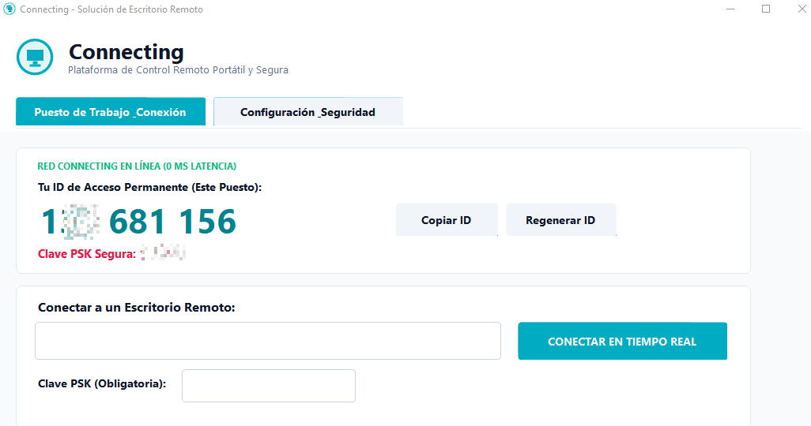
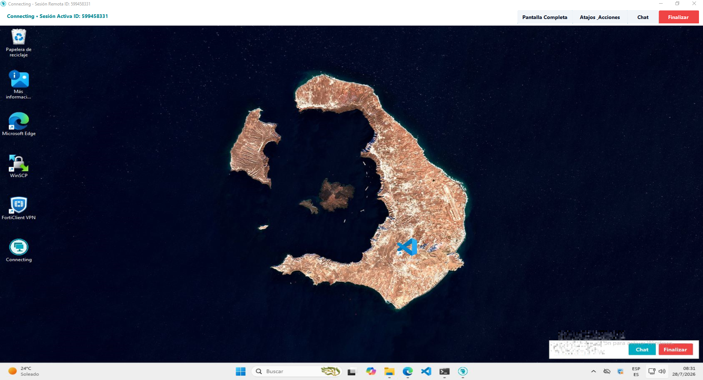

# Connecting Remote Desktop Enterprise (Release v1.0.1)

> **Plataforma de Escritorio y Asistencia Remota Portátil de Ultra Baja Latencia (<20ms), Cifrada y con Soporte On-Premise para Redes Aisladas.**

---

## Capturas de Pantalla de la Aplicación


*Interfaz Principal: Panel de Puesto de Trabajo, Clave PSK Persistente e Historial de Sesiones.*


*Sesión Remota en Vivo: Control remoto de ultra baja latencia con atajos del sistema y chat integrado.*

---

## Visión General

**Connecting v1.0.1** es una solución de control remoto portátil de alta definición desarrollada desde cero en **C# (.NET Framework 4.8 / Win32 Native API)** y enrutada mediante un servidor de relevo nativo en **Node.js**.

Diseñada especialmente para equipos de **Soporte de TI, Administradores de Sistemas y Organizaciones**, Connecting permite realizar intervenciones remotas inmediatas sin necesidad de instalaciones pesadas, sin licencias comerciales restrictivas y con la posibilidad de alojar tu propio servidor Relay **On-Premise** dentro de una red privada corporativa totalmente aislada (VPN / Red Local).

---

## Stack Tecnológico de la Solución

- **Cliente Remoto (Connecting.exe)**: C# (.NET Framework 4.8) compilado de forma nativa a un único archivo .EXE portátil de ~65 KB. No requiere instaladores ni servicios de fondo.
- **Motor de Entrada y Control (NativeInputInjector)**: API Nativa Win32 (SendInput + MapVirtualKey) para control preciso de coordenadas absolutas de ratón (0-65535) y códigos de escaneo físico de teclado.
- **Servidor Relay Privado (connecting-relay-server)**: Servidor de sockets TCP nativo en Node.js (net module) de baja latencia sin dependencias externas.

---

## Compilación desde el Código Fuente (Build from Source)

El ejecutable `Connecting.exe` se genera de forma directa, transparente y determinista a partir del archivo de código fuente abierto `ConectingApp.cs` sin librerías ni binarios propietarios de terceros.

### Comando de Compilación (Windows PowerShell / CMD):
```powershell
C:\Windows\Microsoft.NET\Framework64\v4.0.30319\csc.exe /target:winexe /out:Connecting.exe /win32icon:icon.ico /r:System.dll,System.Drawing.dll,System.Windows.Forms.dll ConectingApp.cs
```

### Garantía de Integridad y Licencia GPLv3:
- **Cero Dependencias Privativas**: Todo el motor de interfaz (Windows Forms nativo), captura de pantalla (GDI+), inyección de eventos (Win32 API) y comunicación por sockets TCP se encuentra implementado íntegramente dentro de `ConectingApp.cs`.
- **Correspondencia 1:1**: El binario `Connecting.exe` distribuido en las Releases corresponde exactamente a la compilación de `ConectingApp.cs` incluida en este repositorio.

---

## Características Principales

1. **Portabilidad Extrema**: Un único archivo ejecutable de 65 KB. No requiere servicios en segundo plano ni permisos de administrador para ejecutarse.
2. **Acceso Desatendido y PSK Persistente**: Configura tu propia contraseña de acceso en la pestaña de Seguridad. La clave se guarda de forma segura en %APPDATA%\ConnectingNodes\custom_psk.dat para reconexiones automáticas.
3. **Conexión Automática con Tecla ENTER**: Introduce el ID o la Clave PSK y presiona ENTER para conectarte instantáneamente.
4. **Hostname y Alias en Historial**: Transmisión automática del nombre de equipo remoto (Environment.MachineName) y opción de edición de Alias personalizados (ej: john-administracion).
5. **Aislamiento Nativo de Teclado**: Envío directo de combinaciones del sistema (Win+R, Win+E, Ctrl+Alt+Supr, Ctrl+Shift+Esc) sin interferir en el equipo local.
6. **Portapapeles Bidireccional & Chat Integrado**: Copia y pega texto entre local y remoto en tiempo real y chatea mediante la barra lateral.
7. **Desconexión Segura e Instantánea**: Paquete binario 0xFF de desconexión enviado al finalizar o cerrar la ventana, destruyendo inmediatamente la sesión en el equipo remoto.

---

## Guía de Despliegue On-Premise con setup-nginx-ssl.sh

Para empresas o redes de TI aisladas que requieren instalar su propio servidor privado con Nginx y Certificados SSL:

### 1. Ejecutar el Asistente de Configuración Nginx + SSL
El repositorio cuenta con el script de despliegue automatizado `setup-nginx-ssl.sh`:

```bash
# 1. Dar permisos de ejecución al script
chmod +x setup-nginx-ssl.sh

# 2. Ejecutar el asistente como superusuario (root / sudo)
sudo ./setup-nginx-ssl.sh
```

El script configurará automáticamente:
- Instalación de Nginx y Certbot (si no están instalados).
- Generación de la configuración Nginx Dual (Web en `/` y Proxy WebSocket en `/ws` hacia el puerto `8443`).
- Expedición y renovación automática de certificados SSL con Let's Encrypt.
- Verificación de sintaxis Nginx (`nginx -t`) y reinicio del servicio.

### 2. Ejecutar el Servidor de Relevo (Node.js)
```bash
cd connecting-relay-server
nohup node server.js > relay.log 2>&1 &
```

### 3. Diagnóstico y Errores Comunes
- **Verificar puerto de escucha**: `ss -tlnp | grep 8443` o `netstat -tlpn`.
- **Verificar sintaxis de Nginx**: `sudo nginx -t`.
- **Revisar estado de certificados SSL**: `sudo certbot certificates`.
- **Permisos del directorio web**: `sudo chown -R www-data:www-data /var/www/connecting.abrdns.com`.

---

## Capacidades y Alcance (Release v1.0.1)

### Lo que SI permite esta versión:
- Control remoto en tiempo real con latencia menor a 20ms.
- Portapapeles bidireccional automático.
- Chat de sesión en vivo.
- Acceso desatendido persistente con Clave PSK personalizada.
- Historial de conexiones de 1 clic con Alias personalizables.
- Inyección nativa de combinaciones de sistema (Win+R, Ctrl+Alt+Supr).
- Desconexión segura inmediata de ambas partes.

### Lo que NO permite esta versión:
- Transmisión de audio remoto en tiempo real.
- Arrastrar y soltar archivos pesados directamente.
- Conexión multitabla de monitores dentro de una misma ventana.

---

## Términos Legales y Licencia Open Source (GNU GPLv3)

**Estado de licencia actual:** Proyecto 100% Open Source Software (OSS) publicado bajo **Licencia Pública General de GNU v3.0 (GPLv3)** en [https://github.com/jh4n3r/connecting](https://github.com/jh4n3r/connecting).

- **Código Fuente Completo:** El código fuente íntegro del cliente Windows C# (`ConectingApp.cs`), el servidor de relevo Node.js (`connecting-relay-server/server.js`) y los scripts de despliegue On-Premise (`setup-nginx-ssl.sh`) están disponibles de forma abierta y transparente bajo los términos de la GPLv3.
- **Uso Autorizado y Consentimiento:** Es responsabilidad del Usuario obtener el consentimiento expreso del propietario u operador de cualquier equipo antes de instalar el Software o configurar acceso desatendido sobre él.
- **Responsabilidad del Despliegue On-Premise:** La seguridad, configuración y mantenimiento del servidor de relevo es responsabilidad exclusiva del Usuario que lo despliega.
- **Marcas de Terceros:** Las referencias a productos de terceros (AnyDesk, TeamViewer, RustDesk, DeskIn) se realizan únicamente con fines de comparación informativa. Dichas marcas son propiedad de sus respectivos titulares. Connecting no está afiliado, patrocinado ni respaldado por ninguna de estas empresas.
- **Exclusión de Garantías y Limitación de Responsabilidad:** EL SOFTWARE SE PROPORCIONA "TAL CUAL" Y SIN GARANTÍAS DE NINGÚN TIPO, SEGÚN LO ESTABLECIDO EN LOS ARTÍCULOS 15 Y 16 DE LA LICENCIA GNU GPLv3.

---

## Contacto Oficial

- **Desarrollador Principal**: @jh4n3r
- **Repositorio Git Oficial**: https://github.com/jh4n3r/connecting
- **Correo Electrónico Oficial**: jh4n3r@outlook.com
- **Sitio Web Oficial**: https://jh4n3r.github.io/connecting/
- **Documentación Técnica**: https://jh4n3r.github.io/connecting/docs.html
- **Términos Legales Completos**: https://jh4n3r.github.io/connecting/terms.html
