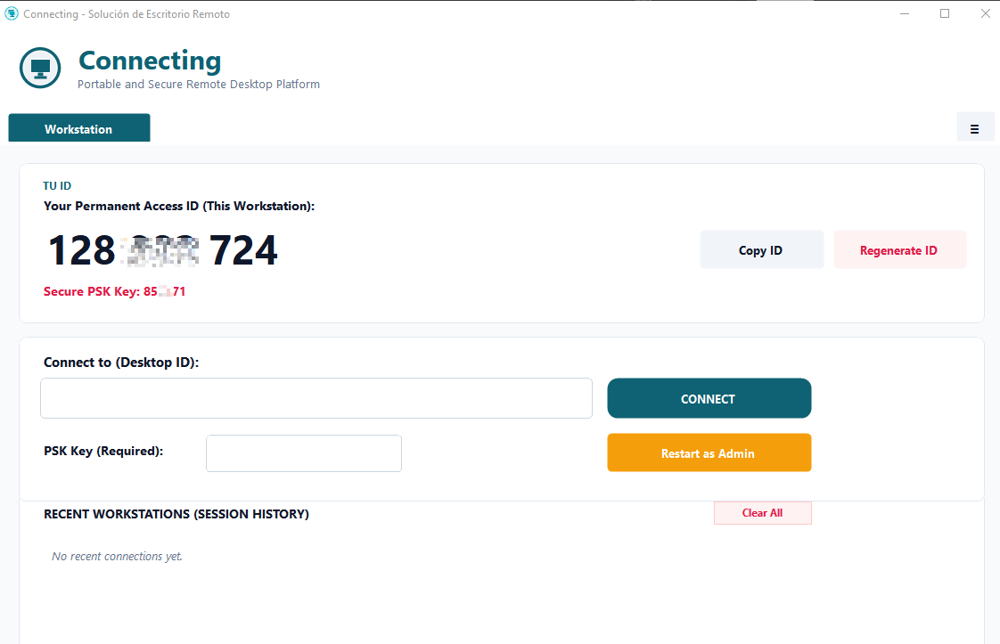
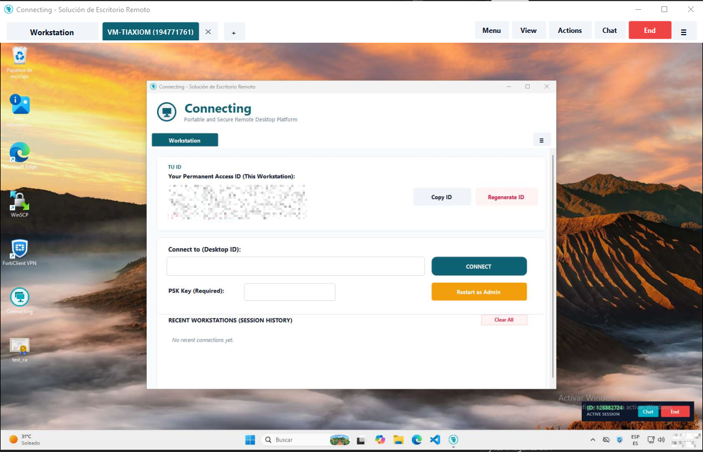
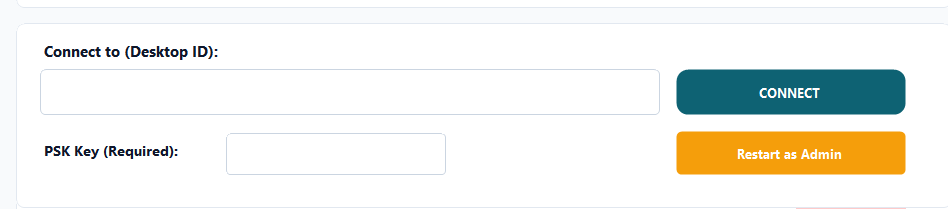
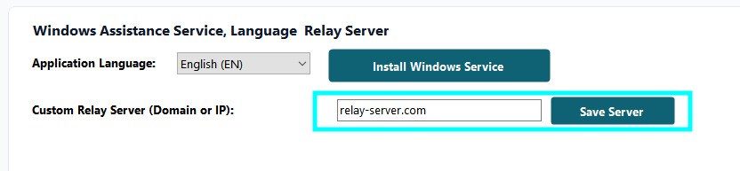

# Connecting Remote Desktop

> **Lightweight, Portable, and Encrypted Real-Time Remote Assistance & Control Platform for Windows & Linux.**

[](https://www.gnu.org/licenses/gpl-3.0)
[]()
[](https://signpath.org/)

---

## Overview

**Connecting Remote Desktop** is a high-performance, open-source remote control solution written natively in **C# (.NET Framework 4.8 / Win32 Native API)** and routed through a ultra-low latency **Node.js TCP relay server**.

Designed for **IT Support Engineers, System Administrators, and Enterprise IT Departments**, Connecting allows instant remote assistance without requiring administrator privileges (`asInvoker`), restrictive commercial licensing, or mandatory cloud dependencies. It supports both public relay routing and self-hosted **On-Premise** corporate deployments.

---

## Application Screenshots


*Main Interface: 9-Digit Permanent Access ID, PSK Security Key, and Recent Workstation History.*


*Live Remote Session: Multi-tab desktop control, real-time clipboard sync, and integrated live chat.*


*Voluntary UAC Elevation: One-click "Restart as Admin" for interacting with elevated system windows.*


*Windows Service Integration: Optional background service installation (`ConnectingService`).*

---

## Key Features

1. **Extreme Portability**: Runs instantly as a portable ~100 KB executable (`asInvoker`). No installer or admin rights required.
2. **Permanent 9-Digit ID**: Generates a unique, cryptographically secure 9-digit node ID persisted in `%APPDATA%\ConnectingNodes\node_id.dat`.
3. **Customizable Relay Server UI**: Configure any custom or self-hosted Relay Server (`domain:port` e.g., `relay.yourdomain.com:8443`) directly from the Settings tab in the Open Source distribution (`build/windows`).
4. **Voluntary UAC Elevation**: One-click elevation restart (`ProcessStartInfo.Verb = "runas"`) to interact with UAC dialogs, Task Manager, and administrative consoles.
5. **Native Key Injection**: Full Win32 `SendInput` coordinate mapping (0–65535) and physical scan-code dispatching (`Win+R`, `Ctrl+Alt+Del`, `Ctrl+Shift+Esc`).
6. **Single-Instance Safety**: Guarded by a System Mutex to prevent duplicate processes or orphaned system tray icons.
7. **Windows Service Support**: Optional background service (`ConnectingService`) for uninterrupted corporate unattended access.
8. **Multi-Tab Sessions & Live Chat**: Manage multiple concurrent remote desktops with tabbed navigation and real-time sidebar messaging.

---

## Building from Source

The project includes clean PowerShell scripts to combine modular source files (`src/*.cs`) and compile deterministically without Visual Studio:

```powershell
cd build/windows

# 1. Combine modular C# source files into ConnectingApp.cs
powershell -ExecutionPolicy Bypass -File .\combine.ps1

# 2. Compile Connecting.exe (with UTF-8 codepage 65001), embed manifest/icon, and sign
powershell -ExecutionPolicy Bypass -File .\build.ps1
```

---

## License & Legal Terms

This project is 100% Open Source Software licensed under the **[GNU General Public License v3.0 (GPLv3)](LICENSE)**.
